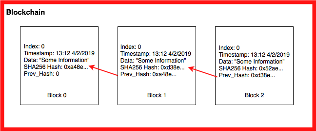

### Problem 5: Blockchain
#### Blockchain
A [Blockchain](https://en.wikipedia.org/wiki/Blockchain) is a sequential chain of records, similar to a linked list. Each block contains some information and how it is connected related to the other blocks in the chain. Each block contains a cryptographic hash of the previous block, a timestamp, and transaction data. For our blockchain we will be using a [SHA-256](https://en.wikipedia.org/wiki/SHA-2) hash, the [Greenwich Mean Time](https://en.wikipedia.org/wiki/Greenwich_Mean_Time) when the block was created, and text strings as the data.  

Use your knowledge of linked lists and hashing to create a blockchain implementation.

  

We can break the blockchain down into three main parts.  

First is the information hash:  