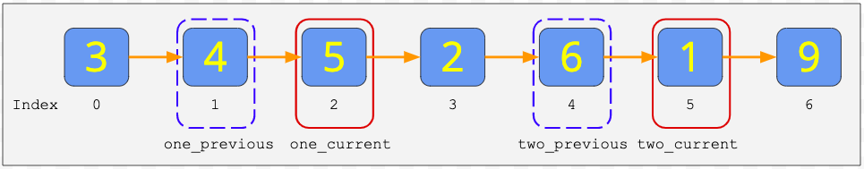
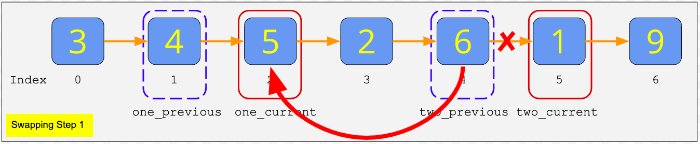
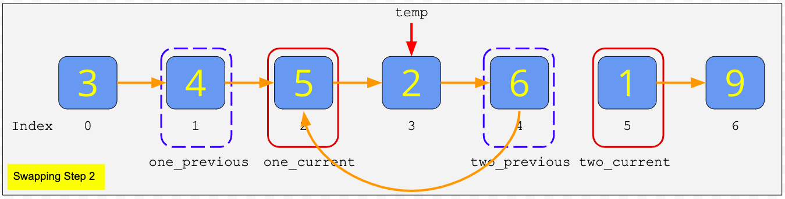
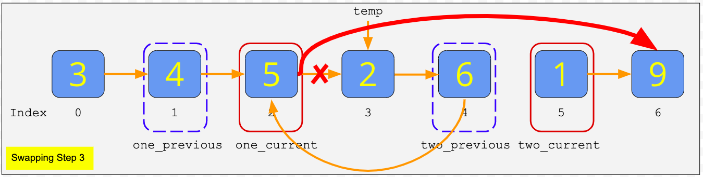
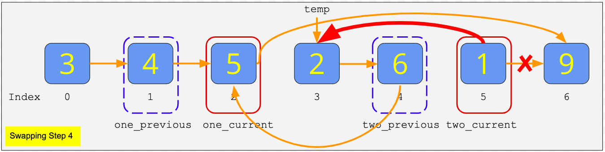
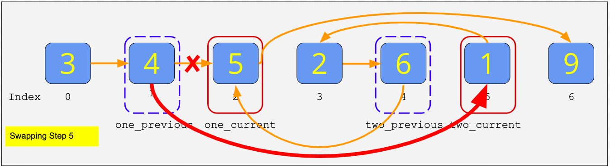
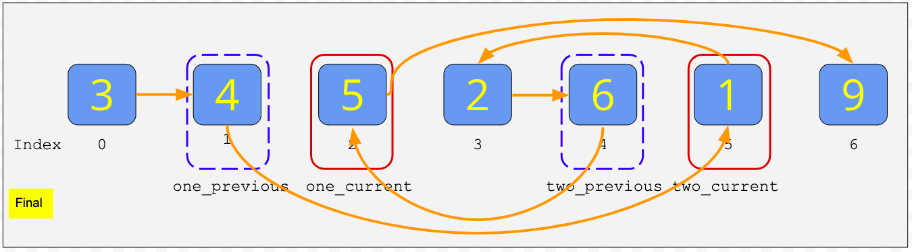

### Arrays and Linked Lists
**Arrays** <br>
When an array is created, it is always given some initial size—that is, the number of elements it should be able to hold (and how large each element is).The computer then finds a block of memory and sets aside the space for the array. Importantly, the space that gets set aside is one, continuous block. That is, all of the elements of the array are *contiguous*, meaning that they are all next to one another in memory. Because of the adjacent locations of array items in memory, we can assign each item an index and use that index to quickly and directly access the item. <br>
Another key characteristic of an array is that **all of the elements** are the same size. <br><br>

**Lists** <br>
In contrast, the elements of a list may or may not be next to one another in memory! In this case, knowing the location of the first item in the list does not mean you can simply calculate the location of the other items. <br>
One thing to **Note** is that `Python lists are essentially implemented as arrays`, but also include additional high-level functionality like `append` and `pop` which regular lists in other languages might not have. In particular, the elements of a Python list are contiguous in memory, and they can be accessed using an index. `Python Strings are also Arrays`. They are arrays of bytes representing unicode characters. <br>
To determine the location of list items in memory, `linked-lists` which are discussed later can be used. <br><br>

**Linked-Lists** <br>
Items in a linked list are joined together by? Wait for it **links** 😀. Unlike arrays, you don't know the length of a linked-list. However, you the know the location of the next item you're accessing because of the link. Items are referred to as nodes. <br>
In higher level languages like *Python*, there's no distinction between linked-lists and arrays. While an array typically stores an attribute `index` to tell you the positions of items, a linked list stores the attribute `next` to point to the location of the next item. <br>
It's easier to insert and delete items from a linked list compared to an array. To insert an element between two nodes, 
1. first assign the next value of the new node to the old node on the right,
2. assign the next value of the old node on the left to the new node being inserted, and the insert operation is complete.

Insertion into a linked list takes constant time O(1). To delete, you just change the `next` attribute of the nodes you wish to keep to ignore the unwanted item. **Note:** the next attribute of the last node in a linked-list is *None*, which is how we know which node is last. <br>

You can also have a **Double-Linked-List** data type which has a `next` and `prev` attribute for each node, pointing to their locations in memory. You need to be careful not to lose references to nodes when inserting or deleting from both data types, however, performing these modifications on lists are less comlex than performing them on arrays. <br>

In python linked-lists can be implemented using classes
```python
class Node:
    def __init__(self, value):
        self.value = value
        self.next = None

head = Node(2)         # Create the first node in the linked-list aka head node
head.next = Node(4)    # Append a new node to the end of the list

print(head.next.value) # Access the value of the second item in the linked-list
4
```

You can also have a **Circular linked-list**. This occur when the chain of nodes links back to itself somewhere. For example `NodeA` -> `NodeB` -> `NodeC` -> `NodeD` -> `NodeB` is a circular list because `NodeD` points back to `NodeB` creating a loop `NodeB` -> `NodeC` -> `NodeD` -> `NodeB`. A circular linked list is typically considered pathological because when you try to iterate through it, you'll never find the end. We usually want to detect if there is a loop in our linked lists to avoid these problems. 
<p align="center">
    <br>
</p>


### Computational Complexity of Flatenning a Nested Linked List
Lets start with the computational complexity of `merge`.  Merge takes in two lists.  Let's say the lengths of the lists are $N_{1}$ and $N_{2}$. Because we assume the inputs are sorted, `merge` is very efficient. It looks at the first element of each list and adds the smaller one to the returned list.  Every time through the loop we are appending one element to the list, so it will take $N_{1} + N_{2}$ iterations until we have the whole list.<br>

The complexity of `flatten` is a little more complicated to calculate.  Suppose our `NestedLinkedList` has $N$ linked lists and each list's length is represented by $M_{1}, M_{2}, ..., M_{N}$.<br>

We can represent this recursion as:<br>

$merge(M_{1}, merge(M_{2}, merge(..., merge(M_{N-1}, merge(M_{N}, None)))))$ <br>

Let's start from the inside.  The inner most merge returns the $nth$ linked list.  The next merge does $M_{N-1} + M_{N}$ comparisons.  The next merge does $M_{N-2} + M_{N-1} + M_{N}$ comparisons. <br>

Eventually we will do $N$ comparisons on all of the $M_{N}$ elements. We will do $N-1$ comparisons on $M_{N-1}$ elements. <br>

This can be generalized as:<br>

$$
\sum_n^N n*M_{n}
$$
<br>

### Computational Complexity of Sorting a Linked List
Computational complexity is $O(N^2)$ where N is the length of the integer array. One insert is $O(M)$ where $M$ is the length of the existing linked list. As the list grows, the time complexity of inserting grows. It's something like $1 + 2 + 3 + 4 + \cdots + N$.<br>

$$
1 + 2 + 3 + 4 + \cdots + N = \sum_n^N n = \frac{N(N+1)}{2}
$$
<br>

Then our time complexity for sorting itself is $O(N^2)$.  Converting from the linked list to an array is $O(N)$. Combined this is $O(N^2 + N) = O(N^2)$. Sorting algorithms such as quicksort and mergesort (which we'll look at later) are $N \log N$, so this algorithm is slower.<br>

### Swapping Nodes in a LinkedList
### Let's take an example to understand a simple approach - 
Given linked list = [3, 4, 5, 2, 6, 1, 9] <br>
position_one = 2<br>
position_two = 5<br>
**Note the original order of indexes - 0, 1, 2, 3, 4, 5, 6**<br>

**Step 1** - Identify the two nodes to be swapped. Also, identify the previous of both the two nodes. 

<br>

**Step 2** - Swap the references making use of a temporary reference
<br><br>
<br><br>
<br><br>
<br><br>
<br><br>
<br>

**Check the order of the updated indexes as - 0, 1, 5, 3, 4, 2, 6**, which implies that index 2 and index 5 have been swapped. 

<br><br>

### Stacks and Queues
 A **stack** is a data structure that consists of two main operations: `push` and `pop`. 
 - A push is when you add an element to the top of the stack and a pop is when you remove an element from the top of the stack.

Stacks can be implemented using arrays or linked lists in python, however, the selected option affects the **time complexity** of stack operations. 
- If we pop or push an element with a linked list stack, there's no traversal. We simply add or remove the item from the head of the linked list, and update the head reference. So with our linked list implementaion, pop and push have a time complexity of **O(1)**.
- If you use arrays, there's a copy overhead that's required each time the array is at capacity. Adding an item to the stack is fine—until we run out of space. Then we would have to create an entirely new (larger) array and copy over all of the references from the old array. *I don't like this because it can create latency overheads for long arrays*. Using a linked list avoids this issue compared to an array implemention of a stack. 
- The copy overhead happens because, with an array, we had to specify some initial size (in other words, we had to set aside a contiguous block of memory in advance). But with a linked list, the nodes do not need to be contiguous. They can be scattered in different locations of memory, an that works just fine. This means that with a linked list, we can simply append as many nodes as we like. Using that as the underlying data structure for our stack means that we never run out of capacity, so pushing and popping items will always have a time complexity of O(1).

<br>

Potential applications of a stack are 
- Implementing a news feed for a web app
- Balancing parentheses in a code editor
- Rearranging text in a string

<br>

Stacks can be easily reversed using a time complexity of O(n) and space complexity of O(n). To reverse the stack, 
- create a new stack
- pop items from the old stack while it isn't empty
- push the popped items into the new stack
Because the stack architecture is LIFO, the first item from the old stack is reversed to the bottom of the new stack. This will typically delete all the items in your original stack, hence the Udacity solution implements a recursive call to keep both the original and reversed stacks populated
